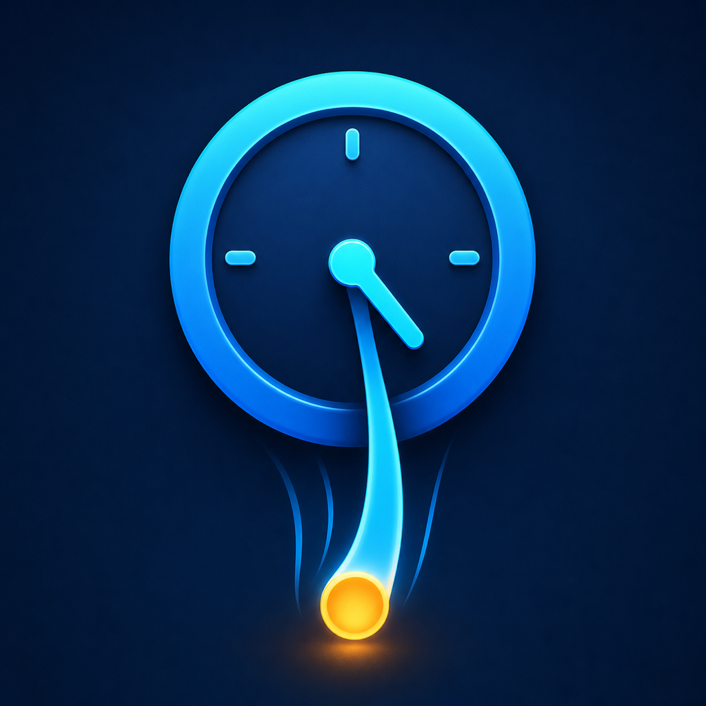

<p align="center">
  
</p>

# Drag Timer

Drag Timer is a native macOS menu-bar timer built around a single gesture: pull time out of the menu-bar icon, release it, and the timer starts. Distance chooses a whole-minute duration, a moving release adds momentum, and useful intervals snap into place with trackpad feedback.

It is a universal Swift/AppKit app for Apple Silicon and Intel Macs running macOS 14 or later. It has no Dock icon. Active timers, unresolved expiries, and bounded history are stored locally in `~/Library/Application Support/DragTimer/`.

## What it does

- Create a timer by dragging from the menu-bar clock icon.
- Choose whether the menu bar shows the nearest deadline, active count, a pinned timer, or a progress ring.
- Create labeled, colored, reorderable Quick start presets with their own sound and notification behavior.
- Save named routines such as Pomodoro or Morning routine and launch all of their timers together.
- Pause, resume, reset, edit, snooze, or cancel timers from the menu-bar popover.
- Snooze, restart, silence, or mark a finished timer done without losing other simultaneous expiries.
- Stop every active timer at once.
- Use Glass or the system beep, with per-timer volume, notification, snooze, and loop settings.
- Receive a macOS notification with sound when a timer finishes.
- Set defaults for every new timer in Preferences.
- Raise the maximum drag-created timer from 4 hours up to 24 hours in Preferences.
- Snap to useful durations and feel a haptic tick when crossing a snap point, with lighter detent ticks as the duration scrubs in between.
- Keep timers correct across sleep, wake, and relaunch by storing absolute fire dates.
- Review 30-day local history and lightweight completion insights, then start any historical timer again.
- Check GitHub Releases quietly and open a newer release for manual installation; Drag Timer never self-updates.
- Give timers a color-and-symbol identity and adjust countdown size, contrast, and urgent treatment.
- Optionally launch at login and choose whether missed timers fire after wake.

## Install a release

Releases include `Drag-Timer-<version>-macos-universal.zip` and `SHA256SUMS.txt`. Each app contains native `arm64` and `x86_64` executable slices.

1. Download the ZIP and `SHA256SUMS.txt` from the [Releases](https://github.com/SaiBarathR/drag-timer/releases) page.
2. Verify the checksum, then unzip the archive and move `Drag Timer.app` to Applications.
3. Because releases are ad-hoc signed rather than notarized with a Developer ID, macOS will show a Gatekeeper warning on first launch. Control-click the app, choose **Open**, then confirm; alternatively use **Open Anyway** in System Settings → Privacy & Security.
4. Drag from the menu-bar timer icon to create your first timer.

Verify the published SHA-256 checksum before opening a downloaded build:

```sh
cd ~/Downloads
shasum -a 256 -c SHA256SUMS.txt
```

## Use

### Create and manage timers

- Click the menu-bar icon to open the timer list. Clicking anywhere outside the popover closes it.
- Press and drag away from the icon. The floating label steps through whole minutes and shows the exact trigger time in real time. If you pause before releasing, the stable preview is the duration that starts.
- Release to name and start the timer; this prompt can be disabled in Preferences. Releasing near common values—such as 1, 5, 15, or 30 minutes—snaps to that duration.
- Open the `…` menu beside a timer to pin it to the menu bar or edit its label, identity, sound, loop behavior, notification, and snooze time.
- Click a Quick start play button to begin a preset timer without dragging.
- Click a routine in the compact Routines strip to start every timer snapshot in that routine at once. The launched timers remain independently controllable.
- Use the pause/play button beside a timer to pause or resume it. Reset and cancel are in the `…` menu.
- At expiry, use **Snooze**, **Restart**, or **Mark done**. The speaker button silences audio without resolving the expiry card.
- Click **Stop all** at the bottom of the popover to cancel every active timer and stop ringing audio. Existing expiry cards still require an explicit action.
- Use the history button in the footer to review completed and cancelled timers, filter the list, clear it, or start a timer again.

### Preferences

Use the sliders button at the bottom-right of the timer popover to open **Drag Timer Preferences**. Preferences is split into General, Presets, Routines, Menu bar, Appearance, Feel, and Updates.

General controls defaults for timers created after the change:

- Timer name, alert sound, and volume
- Whether releasing a drag asks for a timer label (on by default)
- Loop-until-stopped behavior
- Notification delivery and snooze length

General also shows the current macOS notification permission. If permission has not been requested, use **Allow Notifications**. If notifications are off or need adjustment, use **Open Settings** to jump directly to the macOS Notifications pane.

Presets can be added, edited, duplicated, deleted, and reordered. Each preset keeps its own label, duration, color, symbol, sound, volume, looping, notification, and snooze choices. Editing a preset never changes an already-running timer.

Routines can also be added, edited, duplicated, deleted, and reordered. Add a custom five-minute timer or copy any Quick start preset into a routine, then edit and reorder its independent timer snapshots. Changing a preset later does not change the copied routine timer, and changing a routine does not affect timers that are already running.

Menu bar selects the deadline, count, pinned, or ring presentation. Appearance controls countdown scale, contrast, and the urgent threshold. Feel retains the maximum drag duration (4–24 hours), curve, snap, and haptic controls. Updates can run a manual check or disable the once-daily automatic check. System beep follows your Mac’s alert volume; Glass uses Drag Timer’s volume setting.

## Build from source

```sh
swift build
swift run
```

Build an app bundle:

```sh
./Scripts/build-app.sh
open "dist/Drag Timer.app"
```

The script applies an **ad-hoc** code signature to the bundle — required for the app to launch at all on Apple Silicon — but it is not signed with a Developer ID or notarized for frictionless distribution.

## Verify

The XCTest suite and deterministic checks cover whole-minute duration mapping, migration from v1.2.0 settings/timers, expiry resolution and crash recovery, bounded history, rich preset and routine snapshots, parallel routine launches, all menu-bar policies, update parsing/throttling, popover geometry, Stop all behavior, and audio priority.

```sh
swift build
swift test
swift run DragTimer --self-test
```

`swift test` requires the XCTest support included with full Xcode. If `xcode-select` points at Command Line Tools while Xcode is installed in Applications, run it as `DEVELOPER_DIR=/Applications/Xcode.app/Contents/Developer swift test`.

Inspect the packaged app when validating a release build:

```sh
lipo -archs "dist/Drag Timer.app/Contents/MacOS/DragTimer"
codesign --verify --deep --strict --verbose=2 "dist/Drag Timer.app"
plutil -p "dist/Drag Timer.app/Contents/Info.plist"
```

## Release automation

GitHub Actions is configured for macOS 14:

- [CI](.github/workflows/ci.yml) runs on pushes to `main` and pull requests. It builds and tests the source, exercises validator failures, packages both CPU architectures, and verifies the icon and ad-hoc signature.
- [Release](.github/workflows/release.yml) independently repeats every source and packaging gate for the exact tag. It extracts and verifies the final ZIP before publishing, uses the matching tracked notes as the release body, and refuses to overwrite an existing release.

To publish version `vX.Y.Z`, first update `CFBundleShortVersionString` and the positive `CFBundleVersion` in `Packaging/Info.plist`, then add `docs/releases/vX.Y.Z.md`. Validate locally before creating the annotated tag:

```sh
./Scripts/validate-release.sh vX.Y.Z
./Scripts/test-validate-release.sh
swift build
swift test
swift run DragTimer --self-test
./Scripts/build-app.sh
git tag -a vX.Y.Z -m "Drag Timer X.Y.Z"
git push origin vX.Y.Z
```

The workflow also supports a manual dry run before tagging: provide the intended `vX.Y.Z` tag and the exact branch or commit SHA to package. Do not create the tag until the matching [release checklist](docs/release-checklists/) has passed against that release-candidate artifact.

## Architecture

- AppKit owns status-item input, overlay windows, and app lifecycle.
- SwiftUI provides the timer list, expiry card, History, editors, and tabbed Preferences interface.
- Core Animation renders the drag line and duration overlay at display cadence.
- `TimerEngine` schedules only the nearest deadline, batch-creates routine timers with one shared start time, and persists active timers, pending expiries, and idempotent terminal history as Codable JSON.
- `AVAudioPlayer` handles Glass looping; system-beep looping is repeated until stopped.

## Privacy

Drag Timer does not require an account, telemetry SDK, or cloud history. Timer metadata remains on the local Mac and history is capped at 500 entries or 90 days. When update checks are enabled, the app requests only public release metadata from GitHub; it never uploads timer data or downloads an installer. Notifications are requested from macOS only when the packaged app runs.

## License

Drag Timer is open-source software available under the [MIT License](LICENSE).
