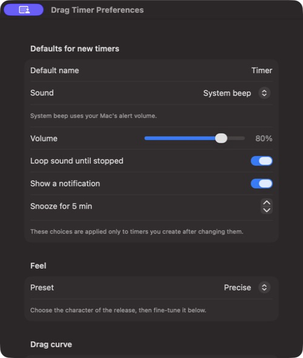
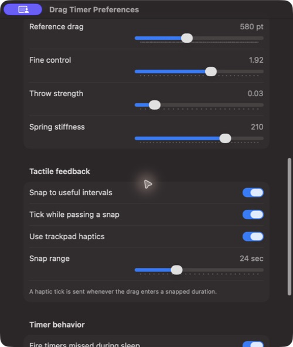

# Drag Timer

Drag Timer is a native macOS menu-bar timer built around a single gesture: pull time out of the menu-bar icon, release it, and the timer starts. Distance chooses the duration, release speed adds momentum, and useful intervals snap into place with trackpad feedback.

It is a Swift/AppKit app for macOS 14 and later. It has no Dock icon and keeps timers in `~/Library/Application Support/DragTimer/timers.json`.

## Screenshots

<p align="center">
  
  
</p>

## What it does

- Create a timer by dragging from the menu-bar clock icon.
- Start 5, 10, 15, or 30 minute and 1, 2, 3, or 4 hour timers with one click.
- Pause, resume, reset, edit, snooze, or cancel timers from the menu-bar popover.
- Stop every active timer at once.
- Use Glass or the system beep, with per-timer volume, notification, snooze, and loop settings.
- Receive a macOS notification with sound when a timer finishes.
- Set defaults for every new timer in Preferences.
- Snap to useful durations and feel a haptic tick when crossing a snap point, with lighter detent ticks as the duration scrubs in between.
- Keep timers correct across sleep, wake, and relaunch by storing absolute fire dates.
- Optionally launch at login and choose whether missed timers fire after wake.

## Install a release

Releases include `Drag-Timer-<version>-macos.zip` and `SHA256SUMS.txt`.

1. Download and unzip the archive from the [Releases](https://github.com/SaiBarathR/drag-timer/releases) page.
2. Move `Drag Timer.app` to Applications.
3. Because releases are ad-hoc signed rather than notarized with a Developer ID, macOS will show a Gatekeeper warning on first launch. Control-click the app, choose **Open**, then confirm; alternatively use **Open Anyway** in System Settings → Privacy & Security.
4. Drag from the menu-bar timer icon to create your first timer.

Verify the published SHA-256 checksum before opening a downloaded build when you want to confirm its integrity.

## Use

### Create and manage timers

- Click the menu-bar icon to open the timer list. Clicking anywhere outside the popover closes it.
- Press and drag away from the icon. The floating label shows both the duration and exact trigger time in real time.
- Release to name and start the timer; this prompt can be disabled in Preferences. Releasing near common values—such as 1, 5, 15, or 30 minutes—snaps to that duration.
- Open the `…` menu beside a timer to edit its label, sound, loop behavior, notification, and snooze time.
- Click a Quick start play button to begin a preset timer without dragging.
- Use the pause/play button beside a timer to pause or resume it. Reset and cancel are in the `…` menu.
- Click **Stop all** at the bottom of the popover to clear every timer and stop a ringing alert.

### Preferences

Use the sliders button at the bottom-right of the timer popover to open **Drag Timer Preferences**.

The top section controls defaults for timers created after the change:

- Timer name, alert sound, and volume
- Whether releasing a drag asks for a timer label (on by default)
- Loop-until-stopped behavior
- Notification delivery and snooze length

Quick start presets are also customizable in Preferences. Enter the durations in minutes; for example, `5, 15, 30, 60, 120` creates buttons for 5, 15, and 30 minutes plus 1 and 2 hours.

The rest of the window controls drag feel, snap range, trackpad haptics, wake behavior, and launch at login. System beep follows your Mac’s alert volume; Glass uses Drag Timer’s volume setting.

## Build from source

```sh
swift build
swift run
```

Build an app bundle:

```sh
./Scripts/build-app.sh
open "dist/Drag Timer.app"
```

The script applies an **ad-hoc** code signature to the bundle — required for the app to launch at all on Apple Silicon — but it is not signed with a Developer ID or notarized for frictionless distribution.

## Verify

The deterministic checks cover duration mapping, inertial release, spring settlement, persistence, timer defaults, and the looping-alert priority path.

```sh
swift build
swift run DragTimer --self-test
```

## Release automation

GitHub Actions is configured for macOS 14:

- [CI](.github/workflows/ci.yml) runs on pushes to `main` and pull requests. It builds the app, runs self-checks, packages the bundle, and confirms it carries a valid ad-hoc signature.
- [Release](.github/workflows/release.yml) runs when a `v*` tag is pushed. It builds the tagged source, creates a ZIP and SHA-256 checksum, then publishes them to the matching GitHub release.

To publish a new version after updating `Packaging/Info.plist`:

```sh
git tag -a v1.0.0 -m "Drag Timer 1.0.0"
git push origin v1.0.0
```

## Architecture

- AppKit owns status-item input, overlay windows, and app lifecycle.
- SwiftUI provides the timer list, editor, and Preferences interface.
- Core Animation renders the drag line and duration overlay at display cadence.
- `TimerEngine` schedules only the nearest deadline and persists timers as Codable JSON.
- `AVAudioPlayer` handles Glass looping; system-beep looping is repeated until stopped.

## Privacy

Drag Timer does not require an account or send timer data to a service. Notifications are requested from macOS only when the packaged app runs; timer data remains on the local Mac.
