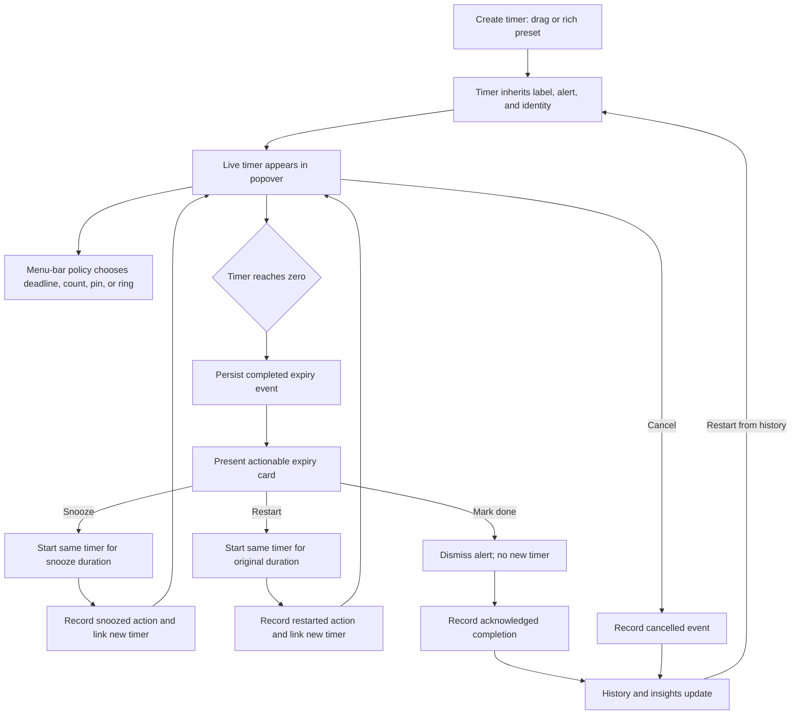
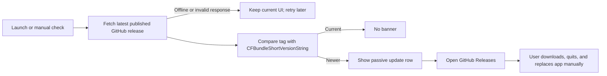
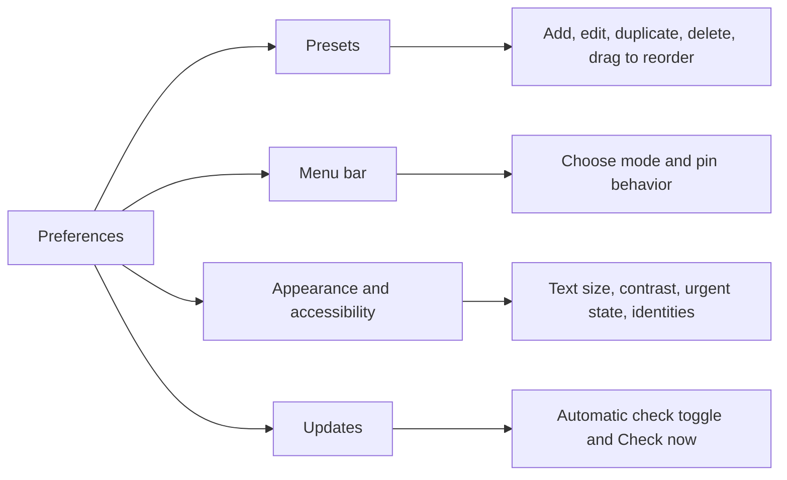

# Drag Timer: six-feature product and implementation plan

Date: 2026-07-13
Status: implementation pass complete on `codex/six-feature-product`; final visual/accessibility QA pending
Target: native macOS 14+ Swift/AppKit/SwiftUI menu-bar app

## Goal

Add six related capabilities without losing Drag Timer's current compact, direct character:

1. A passive update notice that opens GitHub Releases for manual installation.
2. Useful expiry actions: Snooze, Restart, and Mark done.
3. User-selectable menu-bar priority modes.
4. Timer identity and accessibility options.
5. Small, local-only history and lightweight insights.
6. Rich, reorderable quick-start presets.

The interaction principle is **act where the timer is visible**. The popover remains the fastest place to create and handle timers; Preferences owns durable configuration; History is a small secondary window rather than another large block in the popover.

## Executive feasibility verdict

All six features are feasible in the current codebase. The app already has the essential building blocks: stable timer UUIDs, Codable timer persistence, a centralized `TimerEngine`, SwiftUI settings/popover views, a custom-drawn status item, and a tag-driven GitHub release workflow.

The work is not six isolated UI patches. Two shared model changes should be implemented first:

- **Expiry lifecycle:** `TimerEngine` currently removes a timer as soon as it expires. It retains only one looping timer in `activeAlert`; a one-shot alert is not kept as actionable state. Expiry actions and accurate history therefore need a persisted, explicit expiry event/pending-action model.
- **Preset migration:** quick starts are currently `[Int]`, sanitized into sorted unique minute values. Labels, colors, alert settings, duplicate durations, and manual order require a structured `QuickStartPreset` model and backward migration.

No database, account, server, analytics SDK, privileged entitlement, or automatic updater is needed.

## Verification amendments

The implementation audit found several details that need to be explicit before coding:

- **Crash consistency is idempotent, not cross-file atomic.** Active timers, pending expiries, and history are separate persisted concerns. A transition cannot be atomic across independent JSON replacements. Every terminal event therefore uses the expiry event UUID as an idempotency key, history uses upsert semantics, and launch reconciliation repairs a missing history entry from a pending expiry without duplicating one that was already written.
- **Settings decoding must default every additive field.** `AppSettings` currently decodes one Codable blob. New fields use a custom backward-compatible decoder (or optional stored fields with normalized runtime defaults), followed by one persisted migration. A single newly required property must never invalidate the whole v1 settings blob.
- **Notification actions need a launch-race handoff.** macOS may launch the app in response to an action. `NotificationService` must retain a response received before `TimerEngine` installs its handler, then deliver it after persisted timers and pending expiries are reconciled.
- **History needs an origin field.** Excluding snooze-delay children from average planned duration is impossible with only `linkedTimerID`. Timer occurrences therefore carry a `TimerOrigin` (`drag`, `preset`, `history`, `snooze`, or `restart`) plus an optional parent event ID.
- **Update metadata is advisory and URL-pinned.** The live repository currently exposes `v1.2.0` from the documented latest-release endpoint, matching `Packaging/Info.plist`. Decoded links are accepted only when they are HTTPS GitHub URLs under `/SaiBarathR/drag-timer/releases/`; otherwise the fixed repository Releases page is used.
- **Stop all has a narrow lifecycle meaning.** It cancels active timers and silences audio. It does not silently mark unresolved expiry cards done; those keep their own explicit Mark done action so history remains truthful.

These amendments preserve the original six product decisions while closing recovery, migration, and measurement gaps found during source verification.

## Implementation checkpoint — 2026-07-13

Implemented in the first pass:

- actionable persisted expiry queue, notification actions, crash reconciliation, and one-shot/looping audio ownership;
- bounded local history, insights, filters, Again, Clear history, and corrupt-file recovery;
- ordered rich presets with legacy migration, duplicate durations, per-preset alerts, identity, and keyboard reorder alternatives;
- Deadline, Count, Pinned, and Ring menu-bar policies with paused/missing-pin fallbacks;
- timer identities, urgent non-color cues, countdown scaling, contrast handling, and scalable drag-overlay text;
- throttled GitHub release checks, trusted-URL validation, cached results, passive popover notice, and Updates preferences;
- live macOS notification-permission status with request and System Settings recovery actions;
- sidebar Preferences and updated README behavior/privacy documentation.

Automated verification currently covers 53 XCTest cases plus the deterministic self-check. The app bundle builds, carries a valid ad-hoc signature, and launches. Before calling the release definition of done, complete the hands-on VoiceOver/keyboard/appearance matrix, capture replacement screenshots, and exercise notification buttons and sleep/wake on a packaged build.

## Current-code assessment

| Area | Existing implementation | Gap | Feasibility |
| --- | --- | --- | --- |
| Updates | Tag-based GitHub Releases; bundle version in `Packaging/Info.plist` | No network client, version comparison, or update UI | High; small isolated service |
| Expiry | Heap scheduler, audio, notifications, `activeAlert` | Expired timer is removed immediately; only looping alerts remain actionable | High after lifecycle refactor |
| Menu bar | Custom `NSStatusItem` view and 1-second ticker; earliest timer policy isolated in `MenuBarCountdown` | Only earliest deadline text is supported | High; architecture is already policy-driven |
| Accessibility | SwiftUI semantic colors, accessibility labels, Reduce Motion awareness | No app-level contrast/text/urgent preferences; custom AppKit drawing needs explicit adaptation | High |
| History | Active timers persisted to `timers.json` | No terminal-event store or history UI | High; separate bounded JSON store is sufficient |
| Presets | `AppSettings.quickStartMinutes: [Int]`; grid in popover | No stable identity, order, label, appearance, or per-preset options | High with migration |

### Important behavior found in the source

- `TimerRecord` already stores label, duration, alert sound, volume, looping, notification, and snooze settings.
- `TimerEngine.snooze(id:)` only works while a timer remains in `timers`; it cannot snooze the expired timer shown by `activeAlert` because that timer has already been removed.
- A non-looping expiry plays sound but never sets `activeAlert`, so it never receives the current in-app expiry banner.
- `cancel`, `cancelAll`, expiry, and discard-after-wake are distinct paths and must record different history outcomes deliberately.
- `StatusItemController` already owns rendering, width changes, accessibility text, and the one-second refresh loop. It is the right integration point for all menu-bar modes.
- `AppSettings` uses a single Codable blob in `UserDefaults`. Optional fields or an explicit versioned decoder can preserve existing settings.
- The current preset sanitizer sorts and deduplicates values. That behavior must be removed after migration or drag ordering and same-duration presets will not work.

## Product flow



### Update flow



### Preferences flow



## Interaction and visual design

### Design direction

Keep the native macOS vocabulary—system type, SF Symbols, vibrancy, semantic colors, keyboard focus—and add one recognizable product signature: an **identity bead**. It is a compact color-and-symbol marker carried consistently from preset to active timer to expiry card to history. It is informative, not decorative, and it remains distinguishable without color.

The plan intentionally does not restore a large popover title or helper copy. The popover should continue to start with Quick start and keep status beside its action.

### Reference tokens

These are reference accents, mapped through dynamic `NSColor`/SwiftUI semantic variants rather than used as fixed text/background colors:

| Token | Reference | Use |
| --- | --- | --- |
| Focus blue | `#0A84FF` | default identity and selected controls |
| Tea amber | `#FF9F0A` | warm category/preset identity |
| Routine mint | `#32D74B` | neutral recurring timer identity |
| Focus violet | `#BF5AF2` | alternate category identity |
| Urgent red | `#FF453A` | near-zero state and destructive actions only |
| Neutral graphite | `#8E8E93` | paused/inactive identity |

- Type: San Francisco for labels and controls; monospaced digits for all countdowns and numerical insights.
- Shape: color is always paired with an SF Symbol or state label; never use color as the only signal.
- Motion: one intentional transition as a timer crosses the urgent threshold (ring/marker changes state). No pulsing or flashing; respect Reduce Motion.
- Contrast: use system backgrounds and labels, thicken strokes in high-contrast mode, and test Increase Contrast plus light/dark appearances.

### Popover wireframe

```text
┌──────────────────────────────────────┐
│ QUICK START                          │
│ [● cup Tea · 4m] [◆ focus 25m]       │
│ [○ 5m]          [○ 15m]              │
├──────────────────────────────────────┤
│ ! Tea finished                       │
│ [Snooze 5m] [Restart] [Mark done]    │
├──────────────────────────────────────┤
│ ● cup  Tea                    0:42    │
│         [pause]                  […]  │
│ ◆ focus Deep work            18:06    │
│         [pause]                  […]  │
├──────────────────────────────────────┤
│ Stop all · 2 running   [History][Quit][Prefs] │
├──────────────────────────────────────┤
│ New version 1.3.0 available   [Open] │
└──────────────────────────────────────┘
```

The expiry card outranks the update row. If both exist, expiry stays near the timers and the update row stays passive at the bottom. With several simultaneous expiries, show one card at a time with `1 of N`; do not stack multiple full cards.

### Preferences structure

The current long grouped form should be split into a native sidebar or toolbar-tab layout before adding these controls:

1. General — existing defaults, wake, login.
2. Presets — reorderable structured list and editor.
3. Menu bar — display mode, pin fallback, ring source.
4. Appearance — text size, contrast, urgent threshold, available identities.
5. Feel — existing physics and tactile controls.
6. Updates — automatic checks, last result, Check now.

This is a structural usability change, not visual ornament. It keeps new preferences findable and avoids growing the current 680-point scrolling form into a settings wall.

### History wireframe

```text
┌ History ─────────────────────────────────────┐
│ Last 30 days    42 completed   6 snoozed     │
│ Average planned duration 18 min              │
├───────────────────────────────────────────────┤
│ Today                                         │
│ ● Tea · 4 min       Completed  10:42  [Again]│
│ ◆ Focus · 25 min    Snoozed    09:18  [Again]│
│ Yesterday                                     │
│ ○ Laundry · 45 min  Cancelled   18:02 [Again]│
├───────────────────────────────────────────────┤
│ [Clear history…]              Local on this Mac│
└───────────────────────────────────────────────┘
```

History is a separate compact window launched by a clock icon in the popover footer. This preserves the accepted compact popover and gives history enough room for keyboard navigation, grouping, and destructive confirmation.

## Shared data model and lifecycle

### New or revised models

```swift
struct TimerIdentity: Codable, Equatable {
    var color: TimerColorToken
    var symbolName: String
}

struct QuickStartPreset: Codable, Identifiable, Equatable {
    var id: UUID
    var duration: TimeInterval
    var label: String
    var alert: PresetAlertOptions
    var identity: TimerIdentity
}

struct TimerHistoryEntry: Codable, Identifiable, Equatable {
    var id: UUID
    var sourceTimerID: UUID
    var linkedTimerID: UUID?
    var label: String
    var plannedDuration: TimeInterval
    var startedAt: Date
    var endedAt: Date
    var outcome: TimerHistoryOutcome
    var action: ExpiryResolution?
    var origin: TimerOrigin
    var parentEventID: UUID?
    var optionsSnapshot: TimerOptions
    var identity: TimerIdentity
}

struct PendingExpiry: Codable, Identifiable, Equatable {
    var id: UUID                 // expiry-event identity
    var timer: TimerRecord       // immutable snapshot used by actions
    var expiredAt: Date
}
```

Recommended outcome semantics:

- `completed`: timer reached zero. Created immediately and later annotated with `markDone`, `snoozed`, or `restarted` resolution.
- `cancelled`: user cancelled before zero, including Stop all.
- `discarded`: past-due timer was intentionally dropped because “Fire timers missed during sleep” is off. Keep this out of headline insights by default.
- Pausing, resuming, resetting, and editing are not history entries.

This separates **what happened to the timer** from **what the user did after it expired**, avoiding misleading counts and duplicate “completed + snoozed” rows.

### Persistence

- Keep active timers in `timers.json` for compatibility and focused failure recovery.
- Add `history.json` beside it, with each file replacement written atomically through a `TimerHistoryStore`.
- Persist pending expiries so a looping alert or unacknowledged completion remains actionable after relaunch.
- Reconcile stores on launch using expiry event IDs: a pending expiry guarantees one completed history entry, while an existing entry prevents duplication after a crash between file writes.
- Default retention: latest 500 entries or 90 days, whichever is smaller; make Clear history available, but do not add an indefinite/unbounded mode in the first release.
- History contains timer metadata only and never leaves the Mac.
- If history decoding fails, preserve/rename the unreadable file and start an empty history rather than preventing active timers from loading.

### Migration

1. Add optional `identity` to `TimerRecord` decoding; missing values receive the default clock/blue identity.
2. Add `quickStartPresets` as an optional field in stored settings while still decoding `quickStartMinutes`.
3. On first load without structured presets, map each saved minute value to a preset with a stable new UUID, generated label, inherited default alert behavior, and default identity.
4. Persist the migrated structure once. Do not sort or deduplicate afterward.
5. Keep one release cycle of legacy decoding tests.

## Feature 1 — manual GitHub update notice

### User flow

1. App checks quietly after launch and no more than once every 24 hours.
2. It fetches the latest full, published GitHub release.
3. If the release tag is newer than `CFBundleShortVersionString`, the popover shows: `Version 1.3.0 available` and an `Open Releases` action.
4. The action opens the release's GitHub `html_url` in the default browser using `NSWorkspace`.
5. The user downloads, quits Drag Timer, replaces the app, and launches it manually.

### Scope and behavior

- Do not download, mount, replace, relaunch, or self-update.
- Use `GET /repos/SaiBarathR/drag-timer/releases/latest`; public release metadata does not require a token.
- Decode only `tag_name`, `html_url`, `name`, and `published_at`.
- Compare normalized numeric version components (`v1.3.0` → `[1,3,0]`), not lexical strings.
- Ignore drafts and prereleases through the `latest` endpoint contract.
- Cache `lastCheckedAt`, latest result, and optionally `dismissedReleaseTag` in settings.
- Network failure, malformed response, rate limiting, and no releases are silent on automatic checks. Manual “Check now” shows a small result message in Preferences.
- Add `Automatically check for updates` (default on) and `Check now` under Updates.
- Never block launch or timer scheduling on the network request.

### Code changes

- New `Sources/DragTimer/Updates/UpdateChecker.swift` with an injectable `URLSession`/transport and clock.
- New `ReleaseVersion` pure comparison type.
- `AppDelegate`: own the service, trigger a delayed launch check, inject it into popover/settings.
- `TimerPopoverController`: passive bottom update row.
- `SettingsWindowController`: automatic-check toggle, last checked/result, Check now.
- `AppSettings`: check preference, timestamps, and dismissed tag.

### Tests and acceptance

- Compare equal, older, newer, missing patch, leading `v`, malformed, and unexpectedly large versions.
- Decode fixture response and reject invalid/non-HTTPS release links.
- Automatic check is throttled to once per 24 hours.
- Offline launch produces no error dialog and timers still load immediately.
- `Open Releases` opens only the decoded `https://github.com/SaiBarathR/drag-timer/releases/...` URL, with the repository releases page as fallback.
- Current version never shows an update row; newer version does.

### Feasibility

**High, low-to-medium effort.** The release pipeline and bundle version already exist. GitHub provides an unauthenticated latest-release endpoint for public repositories, and AppKit can open the resulting page. The main risks are version parsing and noisy/offline behavior, both straightforward to isolate and test.

## Feature 2 — Snooze, Restart, and Mark done at expiry

### User flow

At zero, show a compact expiry card with the timer identity, label, and three direct actions:

- **Snooze 5m** — stop current sound, resolve this expiry as snoozed, create a new timer from now using the timer's configured snooze duration and same options/identity.
- **Restart** — stop current sound, resolve this expiry as restarted, create a new timer using the timer's original planned duration and same options/identity.
- **Mark done** — stop current sound and resolve/dismiss the expiry with no new timer.

`Stop sound` remains as a small speaker icon that silences audio without resolving the card. Snooze, Restart, and Mark done are the three primary actions; silence is deliberately secondary.

### Engine design

- Replace the single optional `activeAlert` presentation contract with a queue or ordered array of `PendingExpiry` records.
- Audio remains single-channel. Select the audible expiry with the current “looping wins” rule, but do not conflate audible state with actionable expiry state.
- On expiry, as one idempotent lifecycle transition:
  1. remove from active timers/heap,
  2. cancel any pending OS request,
  3. append the completed history entry,
  4. append a pending expiry,
  5. choose/play the audible expiry,
  6. persist active timers, pending expiries, and history.
- If the process exits between those persistence steps, launch reconciliation completes the transition from the stable expiry event ID.
- Add explicit engine APIs: `resolveExpiry(id:as:)`, `snoozeExpiry(id:)`, `restartExpiry(id:)`, and `silenceExpiryAudio()` if silence remains separate.
- Generate a new timer UUID for snoozed/restarted occurrences and link it from the history entry. This gives every run a clean lifecycle while preserving lineage.
- If multiple timers expire together, show earliest unresolved first and `1 of N`; resolving advances to the next. A looping expiry should retain audible priority until resolved or silenced.

### Notification behavior

The in-app expiry card and macOS notifications both get actionable controls. macOS banners display only the first two notification actions, so the OS-banner order is `Snooze` then `Mark done`; `Restart` remains available when the notification is expanded and in the app. `Stop sound` stays an in-app control because notification delivery and Drag Timer's audio playback are separate channels.

### Code changes

- `TimerEngine`: explicit pending-expiry lifecycle and action APIs.
- `NotificationService`: category/action registration, timer ID in notification `userInfo`, and response delegate callback into the engine.
- `AudioAlertPlayer`: no major change; expose/sustain explicit audio ownership by expiry ID if needed.
- `TimerPopoverController`: replace `Stop sound` row with expiry card and multi-expiry navigation.
- New persistence envelope or `PendingExpiryStore` so unresolved expiries survive relaunch.
- `NotificationService` queues an early notification response until its engine callback is installed.
- History integration described in Feature 5.

### Tests and acceptance

- One-shot and looping expiries both create an actionable card.
- Snooze uses configured snooze minutes, same label/options/identity, and a new timer ID.
- Restart uses original duration even if the previous timer had been paused/reset before expiry.
- Mark done stops looping audio and does not create a timer.
- With simultaneous expiries, every timer gets a completed history entry; actioning one does not drop the others.
- A one-shot expiry cannot silence or replace an already-looping expiry.
- Relaunch restores unresolved expiries as silent actionable cards without replaying duplicate notifications or automatically resuming looping audio.
- VoiceOver reads timer label, completion, action names, and queue position.
- Keyboard users can tab through actions; Return activates the focused action and Escape closes only the popover, not the expiry.

### Feasibility

**High, medium effort.** Existing methods already implement most timer recreation logic, but they target active timers. The correct fix is lifecycle separation, not trying to reinsert the removed timer from the view.

## Feature 3 — menu-bar priority controls

### Modes

Use a persisted enum:

1. **Nearest deadline** — current behavior and default; show the earliest running timer's countdown.
2. **Active count** — show the number of running timers. Proposed compact form: clock icon plus `3`; paused timers are excluded and described in the tooltip.
3. **Pinned timer** — show the selected live timer regardless of other deadlines. Add `Pin to menu bar` to each timer's `…` menu and a pin indicator on the row.
4. **Progress ring** — draw a compact circular progress arc around/inside the timer glyph with no countdown text. Source is the pinned timer when valid, otherwise the nearest running timer.

### Fallback rules

- If a pinned timer is paused, continue showing it with a paused glyph; do not silently switch priorities.
- If it is completed/cancelled, clear the runtime pin and fall back to nearest deadline until the user pins another timer.
- With no running timers: collapsed clock icon for deadline/pin/ring; count mode may show `0` only if the user explicitly enables `Show zero count` (default off).
- Tooltip and accessibility label must always name the effective mode, timer, remaining time, and paused state.

### User flow

- Preferences → Menu bar → Display: segmented Picker for Deadline / Count / Pinned / Ring.
- Timer row `…` → `Pin to menu bar`; pinned row shows a small pin symbol.
- Choosing Pinned mode without a live pin shows inline guidance: `Choose Pin to menu bar from a timer's menu.`
- Optional fast path: right-click status item shows the four display modes and current pin without opening Preferences. Implement only after primary flow is stable.

### Code changes

- `AppSettings`: `MenuBarDisplayMode` and optional `pinnedTimerID`; the ring uses the pinned timer when valid and otherwise falls back to the nearest running deadline.
- `MenuBarCountdown`: broaden into pure `MenuBarPresentationPolicy` that returns a render model rather than just earliest timer/text.
- `StatusItemController`: observe both timers and relevant settings; render text/count/pin/ring without disrupting the custom drag tracking or popover anchor lock.
- `StatusItemGeometry`: widths for count and pinned countdown; ring remains collapsed width.
- `TimerPopoverController`: pin/unpin timer-row action.
- AppKit drawing: ring track/progress, paused glyph, urgent state, and high-contrast strokes.

### Tests and acceptance

- Deterministic selection for every mode, including tied deadlines, paused timers, missing pins, and empty lists.
- Changing mode refreshes immediately without relaunch.
- Pin survives relaunch while that active timer exists.
- Cancelling/completing the pin follows the documented fallback and never leaves stale text.
- Popover stays anchored while countdown text width changes, preserving current geometry behavior.
- Dragging from the status icon works in all four modes; the ring/text must not steal the mouse sequence.
- Count updates for create, cancel, pause, resume, completion, and Stop all.
- VoiceOver label accurately describes each visual mode.

### Feasibility

**High, medium effort.** The custom status view is an advantage here because all four render modes can be drawn precisely. Regression risk is concentrated around status width, popover anchoring, and custom drag input, which already have tests and dedicated geometry code.

## Feature 4 — visual identity and accessibility

### Timer identity

For the first version, give each timer/preset an appearance tuple rather than building a full category-management system:

- one of 6–8 curated dynamic color tokens,
- one SF Symbol from a curated searchable list (clock, cup, book, figure.run, washer, flame, pills, briefcase, etc.),
- default identity `clock` + focus blue.

This is the approved first-release scope. People who love a quick menu-bar timer are more likely to value instant visual recognition than maintaining a category taxonomy. A labeled preset such as `Tea · 4 min` with a cup symbol and amber identity already behaves like a useful category, without requiring a second configuration system. Named reusable Category entities can be considered later only if users need to update many presets/timers from one shared category.

Identity appears in:

- rich quick-start buttons,
- live timer progress ring and row,
- expiry card,
- pinned menu-bar ring/glyph where legible,
- history entries,
- timer and preset editors.

### Accessibility settings

- **Countdown size:** Default / Large / Extra large. Applies to popover rows and drag overlay. The menu bar remains constrained by macOS status-bar height; Large there means increased weight/spacing, not an oversized control.
- **High contrast:** System / Always on. Always-on uses stronger separators, opaque card backgrounds, thicker ring strokes, primary-label countdowns, and symbol+text state cues.
- **Urgent visual:** Off / 1 min / 3 min / 5 min / 10 min before zero. Default proposed: 1 minute.
- **Persistent urgent treatment:** urgent red identity ring plus `Exclamation mark` symbol and stronger countdown weight. No animation is required for urgency to remain visible.
- Automatically respect macOS Increase Contrast, Differentiate Without Color, Reduce Transparency, and Reduce Motion even when the in-app override is off.

### Code changes

- `TimerRecord`/`TimerOptions`: optional `TimerIdentity` with backward-compatible decode.
- `AppSettings`: countdown scale, contrast override, urgent threshold.
- New `TimerAppearancePolicy`: pure derivation of normal/paused/urgent/expired visual state from timer, settings, date, and system accessibility inputs.
- `TimerRow`, `TimerEditorView`, quick starts, expiry card, and History: identity controls/rendering.
- `DragOverlayWindowController`: scalable countdown font, urgent color/symbol, high-contrast line/glow policy.
- `StatusItemCaptureView`: high-contrast/ring/urgent presentation; keep a non-color cue.

### Tests and acceptance

- Legacy timers decode with default identity.
- Every color-coded state also has a symbol, label, stroke, or shape distinction.
- Urgent state begins exactly at the configured remaining-time threshold and clears on reset/restart/snooze.
- Large text does not clip a timer row, expiry card, editor, or drag overlay at the maximum supported scale.
- Light, dark, Increase Contrast, Differentiate Without Color, Reduce Transparency, and Reduce Motion are manually verified.
- Menu-bar control remains within status-bar height and retains drag/click hit targets.
- Screenshots are captured for the README after final design approval.

### Feasibility

**High, medium-to-high effort.** SwiftUI surfaces will adapt easily; the Core Animation drag overlay and custom AppKit status drawing require deliberate font metrics and contrast tests. The recommended identity tuple keeps scope contained.

## Feature 5 — local history and lightweight insights

### What is stored

Store one terminal entry per timer occurrence:

- label and identity,
- planned duration and actual elapsed interval,
- start/end timestamps,
- outcome (`completed`, `cancelled`, `discarded`),
- expiry resolution (`markDone`, `snoozed`, `restarted`, or unresolved),
- snapshot of options needed to restart it,
- link to any snoozed/restarted child timer.
- creation origin (`drag`, `preset`, `history`, `snooze`, or `restart`) and parent expiry event when applicable.

Do not store interaction logs, app usage, active-app context, productivity scores, streaks, cloud identifiers, or telemetry.

### UI and insights

- Footer clock icon opens a separate `HistoryWindowController` with a SwiftUI `HistoryView`.
- Group entries by Today / Yesterday / date.
- Each row has `Again`, which creates a timer using the historical planned duration, label, alert options, and identity.
- Summary for the selected range (default 30 days): completed count, cancelled count, snoozed count, and average planned duration.
- Average excludes discarded entries and snooze-child timers. Snooze children remain visible in history and contribute to the snooze count, but excluding their short delay prevents repeated snoozes from making the user's normal planned timer duration look artificially low.
- Provide filters: All / Completed / Cancelled / Snoozed.
- `Clear history…` requires confirmation and does not touch active timers or presets.
- Empty state: `Finished and cancelled timers will appear here. They stay on this Mac.`

### Integration points

- Expiry: append completed entry before presenting actions.
- Mark done/snooze/restart: annotate that completed entry's resolution.
- Cancel: append cancelled entry with actual end time.
- Stop all: append one cancelled entry per active timer, then clear.
- Fire-missed-during-sleep off: append discarded entry or omit it from normal history per the proposed semantics.
- History `Again`: call the same canonical engine creation path as presets, never duplicate scheduling logic in the view.

### Code changes

- New `Sources/DragTimer/History/TimerHistoryEntry.swift`.
- New `Sources/DragTimer/History/TimerHistoryStore.swift` with atomic JSON persistence and retention.
- New `Sources/DragTimer/History/HistoryWindowController.swift` / `HistoryView.swift`.
- `TimerEngine`: injected history store, published recent entries or a separate `HistoryController`, and lifecycle writes.
- `AppDelegate`: own/history window and inject its open callback into popover.
- `TimerPopoverController`: footer History button.

### Tests and acceptance

- Completion, cancel, Stop all, snooze, restart, mark done, discard-on-wake, and relaunch each produce the expected history state exactly once.
- Crash/relaunch cannot duplicate a terminal event; use event UUID/idempotent upsert.
- Retention keeps no more than 500 entries and removes entries older than 90 days.
- Clear history leaves active `timers.json` untouched.
- Again recreates the historical timer with a new timer ID and correct options/identity.
- Insights are deterministic across time zones and daylight-saving transitions; group using `Calendar.current`, store dates as absolute `Date` values.
- Corrupt history does not prevent timers or the app from launching.
- Verify that no history network request exists.

### Feasibility

**High, medium-to-high effort.** JSON is appropriate at this scale. SQLite/Core Data/SwiftData would add migration and packaging complexity without a current query-volume benefit. The main engineering risk is exactly-once event recording across expiry, wake, and relaunch.

## Feature 6 — rich, reorderable presets

### Preset content

Each quick-start preset includes:

- stable UUID,
- duration (1 minute–24 hours),
- label (for example `Tea`),
- sound and volume,
- loop-until-stopped,
- notification on/off,
- snooze duration,
- color and SF Symbol identity.

Quick-starting a preset creates a normal independent `TimerRecord` snapshot. Later edits to the preset do not mutate already-running timers.

### Preferences flow

- Show presets as ordered rows with identity, label, duration, and compact alert summary.
- Drag the entire row or a visible grip to reorder; save immediately on drop.
- `+` opens a preset editor. Row double-click or Edit opens the same editor.
- Row menu: Duplicate, Edit, Delete.
- Allow duplicate durations because `Tea · 4m` and `Steep · 4m` can legitimately differ.
- Keep maximum 12 presets in the first release so the popover grid remains bounded.
- Restore defaults replaces the list only after confirmation if the user has customized it.
- Keyboard alternative to drag: Move up / Move down commands in row menu and accessibility actions.

### Popover behavior

- Use stable preset IDs in `ForEach`, never duration as identity.
- Prefer `Label · duration` on the button, with identity bead/symbol. For narrow/long labels, line-limit and expose full value in help/VoiceOver.
- Preserve a four-column grid for generic short presets; adapt to two columns when labels are present or Dynamic Type/countdown scaling requires more room.
- Starting a preset uses its own alert behavior, not the current global defaults.
- Optional secondary action: Option-click starts without label prompt; normal quick start remains one click and never prompts.

### Code changes

- New `QuickStartPreset` and `PresetAlertOptions` models.
- `AppSettings`: ordered structured array and mutation methods (`add`, `update`, `move`, `remove`, `restoreDefaults`).
- `SettingsWindowController`: replace comma-separated field with reorderable SwiftUI list and editor sheet.
- `TimerPopoverController`: render rich preset buttons and create from preset options.
- Shared identity picker reused by Timer Editor and Preset Editor.
- Remove `sanitizeQuickStartMinutes` sorting/deduplication after migration; validate duration and count without changing order.

### Tests and acceptance

- Legacy minute presets migrate once with preserved existing order and durations.
- Reordering persists across Preferences close and app relaunch.
- Duplicate durations with different labels/options remain separate.
- Create/edit/duplicate/delete/restore actions keep stable IDs where appropriate.
- Quick-started timer receives the exact label, alert settings, snooze, and identity from the preset.
- Existing running timers are unchanged when their source preset is edited/deleted.
- 1 and 1,440-minute bounds and 12-preset limit are enforced with clear inline messages.
- Mouse drag, keyboard movement, and VoiceOver reorder actions all work.

### Feasibility

**High, medium effort.** The settings persistence layer already supports Codable values. The migration and reorder UI are the meaningful changes; timer creation already accepts the required alert options.

## Recommended implementation order

### Phase 0 — architecture and migration safety

1. Introduce versioned/defaulting settings decoding and fixture tests for the actual v1.2.0 `UserDefaults` JSON shape.
2. Add `TimerIdentity` to timer models with legacy decode coverage.
3. Add history and pending-expiry persistence abstractions with injected clocks/file URLs.
4. Add a canonical `TimerTemplate`/creation helper so presets, expiry actions, and history Again share one path.

Exit gate: current active timers and quick-start settings load unchanged from version 1.2.0 data; existing test suite passes.

### Phase 1 — expiry lifecycle plus history foundation (Features 2 and 5)

1. Record terminal lifecycle events exactly once.
2. Separate pending expiry cards from audio playback state.
3. Implement Snooze, Restart, Mark done, simultaneous-expiry queue, and relaunch behavior.
4. Add History window, Again action, filters, summary, retention, and Clear history.
5. Add notification actions after the same in-app action handlers are stable, so both surfaces use one engine contract.

Exit gate: all lifecycle transition tests pass, including wake/relaunch and concurrent expiry.

### Phase 2 — rich presets and identity (Features 6 and identity part of 4)

1. Migrate `[Int]` presets to ordered `QuickStartPreset` values.
2. Build preset editor and accessible reordering.
3. Apply identity bead across quick starts, live timers, expiry cards, and history.
4. Reuse the identity picker in the timer editor.

Exit gate: legacy migration, order persistence, duplicate durations, and snapshot semantics pass.

### Phase 3 — menu-bar modes and accessibility (Features 3 and remaining 4)

1. Refactor menu-bar selection into a pure presentation policy.
2. Implement Deadline, Count, Pinned, and Ring modes plus fallbacks.
3. Add text scale, contrast, urgent threshold, and system-accessibility adaptation.
4. Verify custom drag tracking and popover anchoring in every presentation mode.

Exit gate: visual/accessibility matrix is manually verified and geometry/input regression tests pass.

### Phase 4 — update notice (Feature 1)

1. Add release client, version comparison, throttling, and cached state.
2. Add passive popover row and Updates preferences.
3. Test offline, malformed, current, and newer release fixtures.

Exit gate: update checks never delay launch, only trusted GitHub release URLs open, and manual replacement copy is clear.

### Phase 5 — integration, documentation, and release hardening

1. Run the complete suite and deterministic self-check.
2. Add end-to-end manual scenarios below.
3. Update README feature list, Preferences instructions, privacy section, and screenshots.
4. Verify `Packaging/Info.plist` versioning and the GitHub Release workflow with a prerelease/tag dry run.
5. Package and launch the app bundle, including ad-hoc signature verification.

## End-to-end acceptance checklist

### Core scenarios

- Upgrade from v1.2.0 data with active/paused timers and customized minute presets; no data loss.
- Create a colored/labeled preset, reorder it, start it, edit/delete the preset, and prove the running timer is unchanged.
- Let one-shot and looping timers expire; use all three actions and validate audio, notifications, active timers, and history.
- Expire several timers in one scheduler tick and resolve them in a different order.
- Put the Mac to sleep across deadlines with “fire missed timers” both on and off.
- Quit with an unresolved expiry and relaunch; observe the approved recovery behavior.
- Switch all menu-bar modes with zero, one, several, paused, pinned, urgent, and completed timers.
- Open/close the popover while menu text width changes; confirm it does not jump or detach.
- Use the app entirely by keyboard and with VoiceOver.
- Test light/dark appearance and macOS Increase Contrast, Differentiate Without Color, Reduce Transparency, and Reduce Motion.
- Launch offline, check updates manually, then test current/newer fixture responses.
- Clear history and prove active timers, settings, and presets remain intact.

### Validation commands

```sh
swift build
DEVELOPER_DIR=/Applications/Xcode.app/Contents/Developer swift test
swift run DragTimer --self-test
./Scripts/build-app.sh
codesign --verify --deep --strict "dist/Drag Timer.app"
open "dist/Drag Timer.app"
```

Add focused XCTest files for release comparison/client behavior, settings migration, preset ordering, history persistence/insights, expiry resolution, menu-bar policy, and appearance policy. Extend `SelfCheck` only with deterministic pure-model invariants; keep network/filesystem UI flows in XCTest.

## Estimated change surface

| Area | Files changed/new | Relative size |
| --- | --- | --- |
| Models and migration | `TimerRecord`, `AppSettings`, new preset/identity/history models | Large |
| Engine lifecycle | `TimerEngine`, timer/history/pending-expiry persistence | Large and highest risk |
| Popover | expiry card, rich presets, pin action, history/update footer items | Medium |
| Preferences | navigation restructure, preset/menu/appearance/update panes | Large UI change |
| Menu bar | presentation policy, status drawing, geometry | Medium and regression-sensitive |
| Overlay/accessibility | Core Animation styles and text scale | Medium |
| Notifications | optional notification actions and callbacks | Medium |
| Updates | release service and passive UI | Small-to-medium |
| Tests/docs | migrations, lifecycle, render policies, README/screenshots | Large but separable |

## Risks and mitigations

| Risk | Mitigation |
| --- | --- |
| Existing saved settings stop decoding when fields are added | Make new fields optional or add custom versioned decoding; keep v1.2.0 fixtures |
| Completion/history written twice around wake or relaunch | Give terminal events stable UUIDs and use idempotent upsert/transaction ordering |
| Multiple expiry actions fight over one audio player | Separate pending actions from a single explicit audible-expiry owner |
| Menu-bar modes break drag gesture or popover positioning | Preserve the icon's hit geometry; extend existing anchor/width/drag tests before visual work |
| Color harms dark/high-contrast readability | Dynamic semantic palette, symbol+color pairing, appearance matrix tests |
| Preferences becomes too long | Split into native panes/sidebar before adding controls |
| History grows or feels surveillant | Bounded local JSON, no telemetry, clear retention copy, Clear history |
| GitHub unavailable/rate-limited | 24-hour throttle, silent automatic failures, cached state, manual retry |
| Scope expands into automatic updating/category management | Explicitly keep manual release opening and appearance tuples in v1 |

## Approved product decisions

1. **Both alert surfaces:** Snooze, Restart, and Mark done are available in-app and through actionable macOS notifications. Compact notification banners prioritize Snooze and Mark done because macOS shows only the first two actions there.
2. **Silence remains available:** `Stop sound` becomes a secondary speaker icon. It stops audio without resolving or removing the expiry card.
3. **Safe relaunch:** unresolved expiry cards return after relaunch, but looping sound does not restart automatically.
4. **Useful average:** snooze-child timers remain in history and snooze counts, but are excluded from average planned duration so a cluster of short snoozes does not distort the insight.
5. **Lightweight identity instead of category administration:** color plus SF Symbol lives directly on timers and presets. This delivers category-like recognition with no category-management overhead.
6. **Truthful progress ring:** the ring represents the pinned timer when available, otherwise the nearest running deadline. It never aggregates timers with unrelated durations.

These choices close the product-scope questions for the six-feature implementation. Any later category-management or aggregate-insight work should be treated as a separate follow-up rather than silently expanding this release.

## Definition of done

The six-feature set is complete when:

- all six user-facing flows work in the packaged macOS app;
- v1.2.0 timers/settings migrate without loss;
- expired timers are actionable and recorded exactly once;
- all menu-bar modes preserve drag/click/popover behavior;
- every color cue has a non-color equivalent and the accessibility matrix passes;
- history is bounded, local-only, clearable, and excluded from all network traffic;
- update checking only opens GitHub Releases and never self-installs;
- build, XCTest, self-check, packaging, signature, and manual launch validation all pass;
- README and current screenshots describe the shipped behavior.

## External platform references

- GitHub's public latest-release REST endpoint returns the most recent published, non-draft, non-prerelease release and can be used without authentication for public repositories: <https://docs.github.com/en/rest/releases/releases#get-the-latest-release>
- `NSWorkspace.open(_:)` opens a URL in its associated application and is suitable for handing the release page to the browser: <https://developer.apple.com/documentation/appkit/nsworkspace/open(_:)>.
- macOS notification categories support actions, but a banner shows only the first two: <https://developer.apple.com/documentation/usernotifications/unnotificationcategory/actions>.
